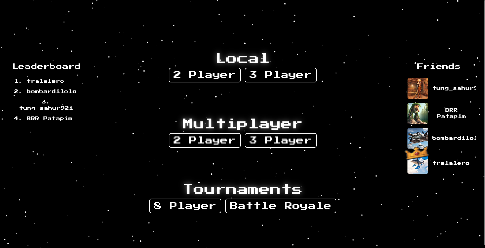

# ft_transcendence



**ft_transcendence** est le dernier projet du Common Core de 42. Il s'agit d'une application web Single Page Application (SPA) permettant de jouer au Pong en temps réel contre d'autres joueurs ou une IA.

## 🚀 Fonctionnalités

### 🎮 Modes de Jeu
- **Classique 1v1** : Affrontez un autre joueur en ligne.
- **Mode 4 Joueurs** : Une variante chaotique où 4 joueurs s'affrontent sur un terrain carré (2 axes). Le dernier à toucher la balle marque le point.
- **Tournoi** : Système de tournoi à 4 joueurs avec demi-finales et finale.
- **Contre l'IA** : Entraînez-vous contre une intelligence artificielle avec plusieurs niveaux de difficulté.
- **Jeu Local** : Jouez à deux sur le même clavier.

### 👤 Gestion Utilisateur
- **Authentification** : Connexion via email/mot de passe ou OAuth (Google / 42).
- **Sécurité** : Authentification à deux facteurs (2FA) disponible.
- **Profil** : Avatar personnalisé, historique des matchs, statistiques (victoires/défaites).
- **Social** : Système d'amis, voir le statut en ligne des joueurs.

### 🛠️ Technique
- **Single Page Application (SPA)** : Navigation fluide sans rechargement de page, gestion de l'historique navigateur.
- **Temps Réel** : Utilisation de WebSockets (Socket.IO) pour le gameplay et les notifications.
- **Responsive** : Interface adaptée aux différentes tailles d'écran.

## 🛠️ Stack Technique

### Frontend
- **Langage** : TypeScript (Vanilla, sans framework JS majeur comme React/Vue).
- **Style** : Tailwind CSS pour le design.
- **Rendu** : Canvas HTML5 pour le jeu.

### Backend
- **Serveur** : Node.js avec le framework **Fastify**.
- **Base de données** : SQLite (via `better-sqlite3`).
- **Communication** : Socket.IO pour les échanges temps réel.

### Infrastructure
- **Docker** : Conteneurisation complète (Frontend, Backend, Nginx).
- **Nginx** : Serveur web et reverse proxy.

## 📦 Installation et Lancement

### Prérequis
- Docker & Docker Compose
- Make

### Commandes

Lancer le projet (version complète avec background animé) :
```bash
make
```

Lancer la version "Light" (compilation plus rapide, background statique) :
```bash
make light
```

Arrêter les conteneurs :
```bash
make down
```

Nettoyer les données (base de données, images uploadées) :
```bash
make rm-data
```

L'application sera accessible à l'adresse : `https://localhost:8080` (ou `http://localhost:3000` selon la configuration Nginx, par défaut HTTPS sur 8080 avec certificat auto-signé).

## 👥 Auteurs

Projet réalisé dans le cadre du cursus 42.
